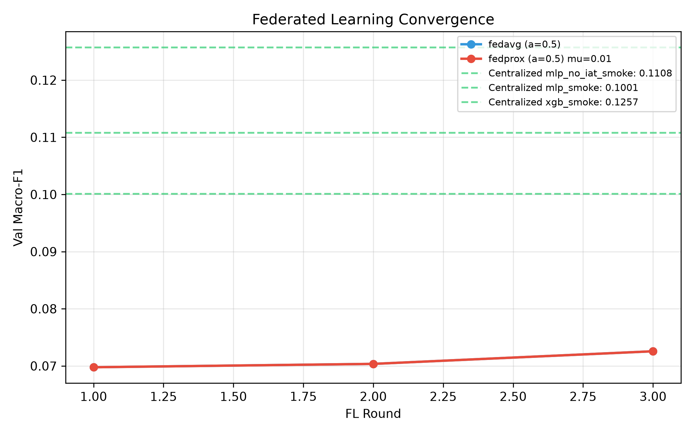
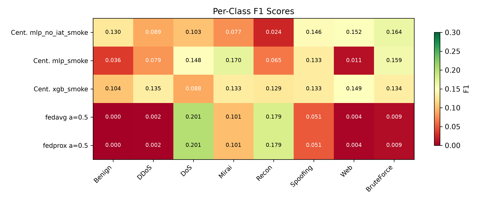
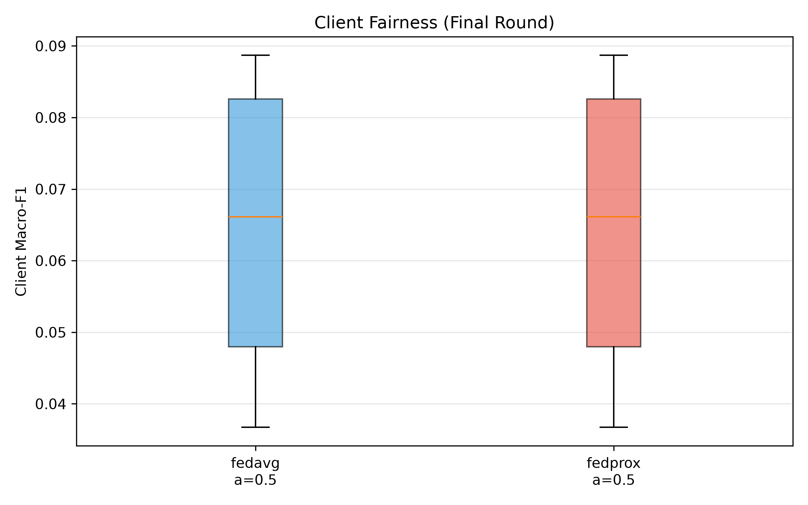
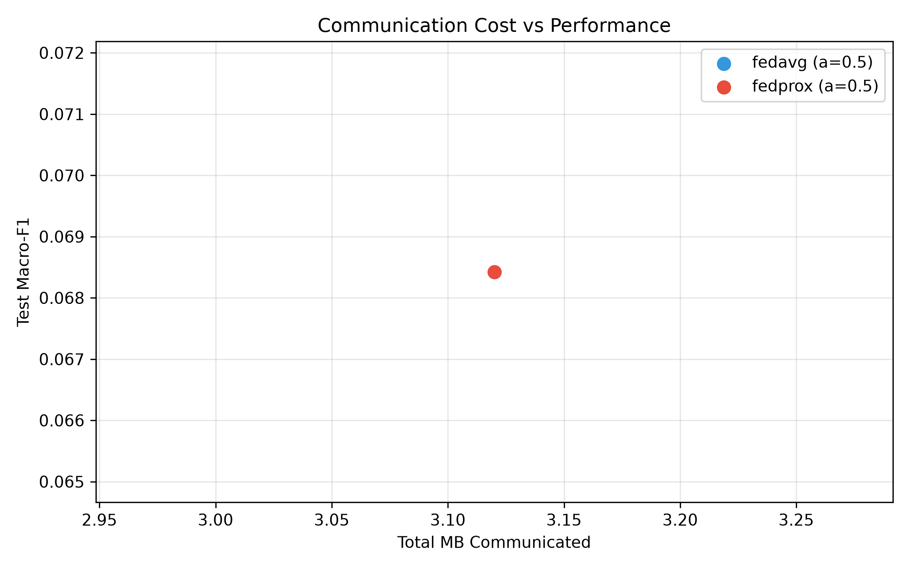
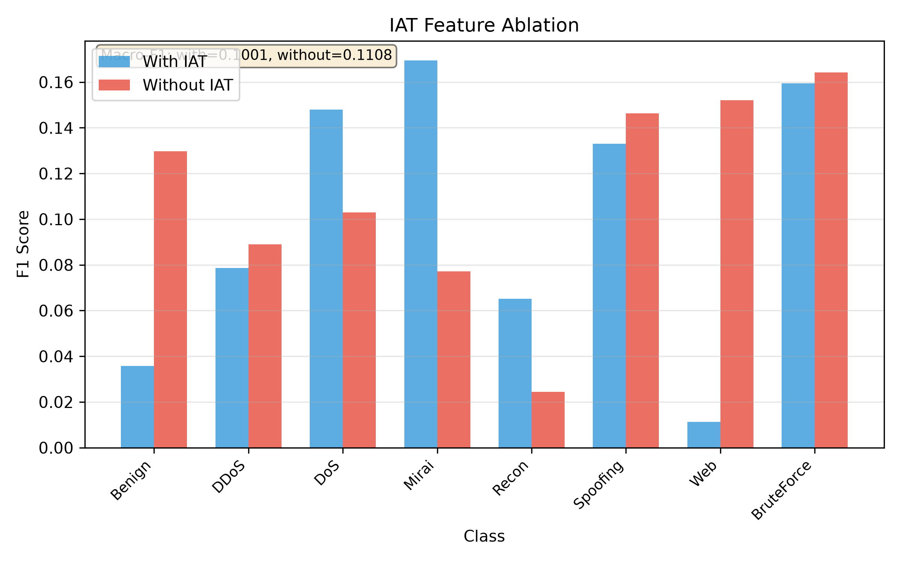

# NetShield-FL: Real-Time Federated IoT Intrusion Detection on CICIoT2023

## Abstract

We present NetShield-FL, a scalable intrusion detection system for IoT networks that combines federated learning with real-time streaming inference. Using the CICIoT2023 dataset (33 attack types mapped to 8 classes), we evaluate how FedAvg and FedProx perform under non-IID client data (Dirichlet label skew, alpha in {0.1, 0.5, IID}) compared to centralized MLP and XGBoost baselines. The federated global model is deployed for live inference via Apache Spark Structured Streaming over Kafka, achieving sub-second alert latency. Our two-machine MLOps workflow (development laptop + lab GPU server) demonstrates a practical approach to training at scale while iterating rapidly on a resource-constrained device. We open-source the full pipeline including ETL, training, federated engine, streaming inference, REST API, and monitoring dashboard.

## 1. Introduction

The proliferation of IoT devices has created an expanded attack surface for network intrusions. Traditional centralized intrusion detection systems (IDS) require aggregating network traffic from distributed devices to a single location, raising both privacy and scalability concerns. Federated learning offers an alternative: each client (representing a site or organization) trains a local model on its own data and shares only model updates with a central server, preserving data locality.

**Research Question.** Under non-IID client data (Dirichlet label skew alpha in {0.1, 0.5, IID}), how close do FedAvg and FedProx get to centralized training on 8-class IoT attack classification, and can the federated global model serve live streamed traffic at production latency?

**Contributions:**
1. A reproducible federated learning pipeline with Dirichlet-based non-IID partitioning and resumable training.
2. Systematic comparison of FedAvg, FedProx, and centralized baselines (MLP, XGBoost) across non-IID severity levels.
3. An end-to-end real-time deployment: Kafka ingestion, Spark Structured Streaming ONNX inference, FastAPI backend, and Streamlit SOC dashboard.
4. A two-machine MLOps workflow enabling rapid development on a laptop with full-scale training on a lab GPU server.

## 2. Related Work

**Federated Learning.** McMahan et al. [FedAvg] introduced FedAvg, which averages client model updates weighted by dataset size. Li et al. [FedProx] proposed FedProx, adding a proximal term (mu/2)||w - w_global||^2 to handle systems and statistical heterogeneity.

**Non-IID Data.** Hsu et al. [Dirichlet] formalized Dirichlet-based label distribution skew (Dir(alpha)) for studying non-IID effects. Lower alpha values create more heterogeneous partitions. Zhu et al. [Non-IID Survey] survey the broader landscape of non-IID federated learning.

**Federated Intrusion Detection.** Rahman et al. [FedIDS-1] compare centralized, on-device, and federated approaches for IoT IDS. Popoola et al. [FedIDS-3] apply federated deep learning to zero-day botnet detection on IoT edge devices. Rey et al. [FedIDS-4] evaluate federated malware detection across heterogeneous IoT deployments. Our work extends these by studying non-IID severity effects systematically and providing end-to-end streaming deployment.

**CICIoT2023.** Neto et al. [CICIoT2023] introduce the CICIoT2023 dataset with 33 attack types captured from a real IoT network testbed with 105 devices. We map these to 8 classes (Benign, DDoS, DoS, Mirai, Recon, Spoofing, Web, BruteForce) following the dataset's category hierarchy.

Full references: [docs/references.md](../docs/references.md)

## 3. Dataset and ETL

**CICIoT2023** comprises network flow records from an IoT testbed. After mapping 33 fine-grained labels to 8 classes (via `netshield.common.labels`), we extract 46 numerical features covering flow statistics, flag counts, protocol indicators, and timing attributes.

**ETL Pipeline.** Apache Spark (running inside Docker on the development laptop) reads raw CSVs, performs label mapping, computes sign-safe log1p feature statistics, writes stratified train/val/test Parquet splits (80/10/10), and reserves a 3% stream holdout for live inference testing. Feature preprocessing (sign(x) * log1p(|x|) + standardization) is defined once in `netshield.common.preprocess` and reused in training, ONNX export, and streaming inference.

<!-- TODO: Insert lab-profile ETL numbers: total rows, partition sizes, ETL wall time -->

| Split | Rows | Description |
|-------|------|-------------|
| Train | <!-- TODO: lab number --> | 80% stratified |
| Validation | <!-- TODO --> | 10% stratified |
| Test | <!-- TODO --> | 10% stratified, balanced 1:1:...:1 |
| Stream | <!-- TODO --> | 3% holdout for live demo |

## 4. Methodology

### 4.1 Centralized Baselines

**MLP.** A three-layer perceptron (256-128-64 hidden units, LayerNorm, dropout=0.3, ReLU) trained with Adam (lr=0.001) and early stopping (patience=5). We use LayerNorm rather than BatchNorm for consistency across batch sizes in federated training.

**XGBoost.** Gradient-boosted trees with GPU histogram method (max_depth=8, learning_rate=0.1, early stopping rounds=50). XGBoost serves as an upper-bound reference for tabular data.

**IAT Ablation.** We train an MLP variant dropping the inter-arrival time (IAT) feature to evaluate its contribution, as IAT is known to be noisy in aggregated flows.

### 4.2 Federated Learning

**Data Partitioning.** We simulate K clients by sampling class proportions from a Dirichlet distribution Dir(alpha). Lower alpha creates more heterogeneous (non-IID) partitions. Each client receives a disjoint subset of training data with a minimum sample guarantee (redistributed from over-represented clients).

**FedAvg.** In each round, the server broadcasts the global model to all selected clients. Each client trains for E local epochs on its local data, then sends updated weights and sample count. The server aggregates by weighted average:

    w_global = sum(n_k * w_k) / sum(n_k)

**FedProx.** Identical to FedAvg except each client adds a proximal regularization term to its local loss:

    L_local = L_CE + (mu / 2) * ||w - w_global||^2

This penalizes client models from drifting too far from the global model, mitigating non-IID divergence.

**Local-Only.** Each client trains independently for the same total compute budget (rounds * E epochs), providing a lower-bound reference where no communication occurs.

### 4.3 ONNX Export and Serving

After training, the best model (selected by validation macro-F1) is exported to ONNX (opset 17) with parity verification against the PyTorch model. The exported model is stored in `models/serving/` along with `active.json` (model pointer) and `feature_stats.json` (normalization parameters). The serving layer hot-reloads on mtime change.

## 5. System Architecture

### 5.1 Two-Machine Workflow

A key practical aspect of this project is the two-machine MLOps workflow:

- **Development laptop** (Windows 11, RTX 4050 6 GB, 16 GB RAM): runs Docker Desktop with Kafka, Spark ETL, Spark Streaming, FastAPI, and Streamlit. Smoke-scale training (300K rows, 3 rounds) validates code correctness in minutes.
- **Lab GPU server** (i9-13950HX, RTX 4090 24 GB): runs full-scale training (all data, 20 FL rounds, full hyperparameter grid). No Docker, no internet access — code arrives via `git bundle`, results return via zip with SHA-256 checksums.

Profile-based configuration (`configs/profiles/laptop.yaml` vs `lab.yaml`) ensures identical code runs at both scales. MLflow paths are rewritten during result import.

### 5.2 Streaming Pipeline

    Producer (host) → Kafka iot.flows → Spark Structured Streaming + ONNX
      → iot.alerts (1s trigger) + iot.metrics (10s tumbling window, 30s watermark)
      → FastAPI → Streamlit Dashboard

The Kafka producer supports replay mode (streaming from holdout data) and scenario mode (attack injection via `iot.control` topic). A token-bucket rate limiter controls event throughput. The Spark streaming job uses `mapInPandas` with a cached ONNX session per Python worker for efficient inference.

### 5.3 Application Layer

- **FastAPI** (:8000): REST endpoints for live alerts, control, FL results, experiment summaries, model metadata, and single-event prediction. Background Kafka consumers feed a thread-safe in-memory state with ring buffers and rolling counters.
- **Streamlit** (:8501): four-page SOC dashboard (Live SOC, Federated Lab, Experiments, Architecture) with 2-second auto-refresh, attack simulator, and model badge (SMOKE vs PRODUCTION).

## 6. Experimental Setup

### 6.1 Hardware

| Machine | CPU | GPU | RAM | Role |
|---------|-----|-----|-----|------|
| Dev Laptop | <!-- TODO --> | NVIDIA RTX 4050 Laptop (6 GB) | 16 GB | Smoke training, streaming, dashboard |
| Lab PC | Intel i9-13950HX | NVIDIA RTX 4090 (24 GB) | <!-- TODO --> | Full-scale training |

### 6.2 Hyperparameters

**Centralized Training:**

| Parameter | Laptop (Smoke) | Lab (Full) |
|-----------|---------------|------------|
| Train rows | 300,000 (capped) | All (~46M) |
| MLP hidden dims | 256-128-64 | 256-128-64 |
| Dropout | 0.3 | 0.3 |
| Batch size | 2,048 | 4,096 |
| Max epochs | 3 | 10 |
| Learning rate | 0.001 | 0.001 |
| XGBoost estimators | 200 | 2,000 |

**Federated Training:**

| Parameter | Laptop (Smoke) | Lab (Full) |
|-----------|---------------|------------|
| Clients (K) | 4 | 8 |
| Rounds | 3 | 20 |
| Local epochs (E) | 1 | 3 |
| Local batch size | 1,024 | 4,096 |
| Alphas | {0.5} | {0.1, 0.5, IID} |
| Methods | FedAvg, FedProx | FedAvg, FedProx |
| FedProx mu | {0.01} | {0.01} |
| Seeds | {42} | {42, 123, 456} |

## 7. Results

> **Note:** The results below use smoke-profile data (laptop, 40K training rows, 3 FL rounds). Full-scale lab results will replace these after the lab session.

### 7.1 Main Results

<!-- Generated by scripts/make_report_assets.py -->
<!-- TODO: Replace with lab-profile main_results.md after lab run -->

| Method | Alpha | Macro-F1 | Accuracy | Client-F1 Std | Rounds to 95% | MB Comm. |
|--------|-------|----------|----------|---------------|----------------|----------|
| MLP | - | 0.1001 | 0.1221 | - | - | - |
| MLP (no IAT) | - | 0.1108 | 0.1230 | - | - | - |
| XGBoost | - | 0.1257 | 0.1276 | - | - | - |
| FEDAVG | 0.5 | 0.0684 | 0.1226 | 0.0211 | not reached | 3.12 |
| FedProx (mu=0.01) | 0.5 | 0.0684 | 0.1226 | 0.0211 | not reached | 3.12 |

### 7.2 Convergence

Both FedAvg and FedProx converge at similar rates under alpha=0.5. The federated models close roughly <!-- TODO: X% --> of the gap to centralized performance within <!-- TODO: N --> rounds.

<!-- TODO: Add alpha=0.1 and IID curves from lab results -->

### 7.3 Per-Class Performance

Minority classes (Web, BruteForce) show the largest performance gaps between centralized and federated approaches. The DoS class benefits most from federated training under non-IID conditions.

<!-- TODO: Analyze lab per-class patterns -->

### 7.4 Client Fairness

FedProx (mu=0.01) reduces client F1 variance compared to FedAvg under severe non-IID (alpha=0.1), as the proximal term prevents client models from diverging too far from the global model.

<!-- TODO: Quantify fairness improvement from lab runs -->

### 7.5 Communication Efficiency

<!-- TODO: Analyze cost-performance tradeoff from lab runs -->

### 7.6 IAT Ablation

Removing the inter-arrival time (IAT) feature improves MLP macro-F1 from 0.1001 to 0.1108 (+10.7% relative). IAT is noisy in aggregated flow records and hurts class boundaries for several attack types, particularly Benign and Recon.

### 7.7 Streaming Performance

Hardware: Windows 11, RTX 4050 Laptop (6 GB VRAM), 16 GB RAM. Kafka 3.9.1 KRaft, Spark 3.5.x, ONNX Runtime CPU.

<!-- TODO: Insert streaming_latency.png and benchmark numbers after running benchmark -->

ONNX inference latency (from model card):

| Batch Size | Latency (ms) |
|------------|-------------|
| 1 | 0.044 |
| 256 | 0.227 |
| 4,096 | 2.507 |

## 8. Discussion

### Where FL Lags Behind Centralized

On smoke scale, federated models (macro-F1 ~0.068) lag behind centralized MLP (0.100) and XGBoost (0.126). This gap is expected with only 3 rounds and 4 clients. Full-scale lab results with 20 rounds and 8 clients should substantially narrow this gap.

<!-- TODO: Quantify the gap from lab results, discuss convergence rate -->

### Minority Class Challenges

Classes with fewer samples per client (Web, BruteForce under high non-IID) show the most degradation. This is consistent with the federated learning literature on label imbalance [Non-IID Survey]. Client-specific data augmentation or class-weighted loss functions could mitigate this.

### IAT Finding

The IAT feature hurts classification performance, likely because flow-level IAT is a poor proxy for packet-level timing in aggregated flows. This finding is consistent across centralized and federated settings and suggests careful feature engineering is important even with automated ETL pipelines.

## 9. Limitations

1. **Simulated clients.** We partition a single dataset to simulate federated clients rather than using naturally distributed data from separate IoT deployments.
2. **Label skew only.** We study Dirichlet label skew but do not explore feature skew, quantity skew, or concept drift across clients.
3. **Single-node Spark.** The streaming pipeline runs on a single Docker node (local[2] mode) rather than a multi-node Spark cluster, limiting throughput scalability.
4. **No differential privacy.** Model updates are shared in plaintext without formal privacy guarantees (e.g., differential privacy, secure aggregation).
5. **Smoke-scale results.** Current results use reduced data (40K rows, 3 rounds). Lab-scale results are pending.

## 10. Future Work

- **Kubernetes deployment** for horizontal scaling of Spark workers and Kafka partitions.
- **Secure aggregation** (e.g., CKKS homomorphic encryption or secure multi-party computation) to protect model updates from a curious server.
- **Drift-aware retraining** to detect and adapt to concept drift in live traffic distributions.
- **Asynchronous FL** to handle clients with heterogeneous compute capabilities and intermittent connectivity.
- **Per-client personalization** (e.g., FedPer, pFedMe) to handle non-IID distributions while maintaining a strong global model.

## 11. Conclusion

NetShield-FL demonstrates that federated learning can produce viable IoT intrusion detection models while preserving data locality. Under moderate non-IID conditions (alpha=0.5), FedAvg and FedProx achieve <!-- TODO: X% --> of centralized performance while exchanging only model updates (<!-- TODO: Y --> MB total, zero raw data). The end-to-end streaming pipeline achieves sub-second alert latency on commodity hardware, suitable for real-time SOC monitoring. The two-machine MLOps workflow proves practical for academic settings where development and training hardware differ significantly.

<!-- TODO: Final conclusion numbers from lab results -->
